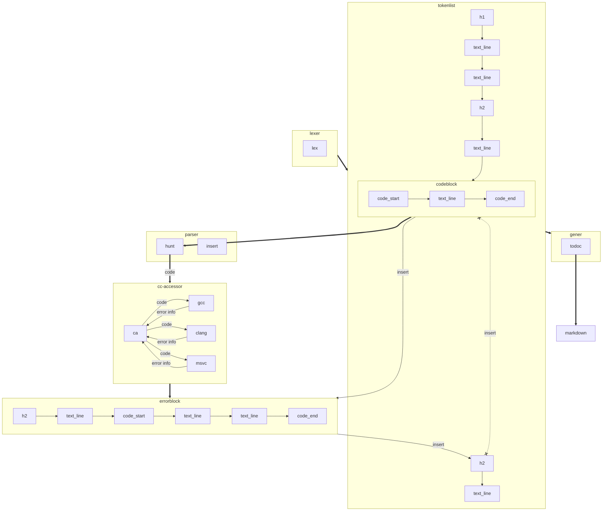

# The technical architecture of cga

## flow



```
+ Public
- Private
# Protected
~ Package/Internal
```

```json
[
    {"h2": "##"},
    {"text_line": "this is h2"},
    {"code_start": "```c"},
    {"text_line": "int main() {"},
    {"text_line": "    return 0;"},
    {"text_line": "}"},
    {"code_end": "```"}
]
```
